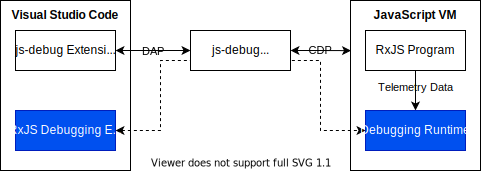
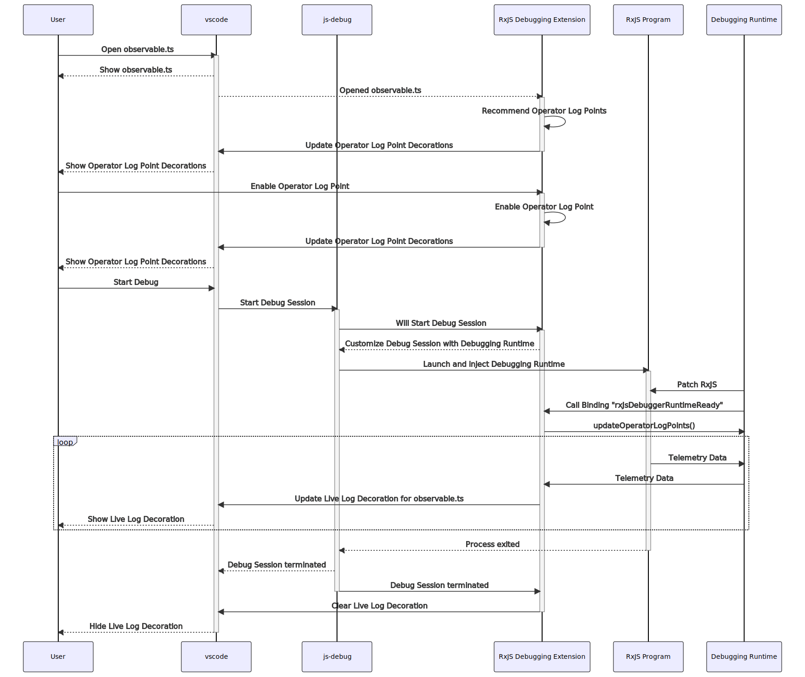

# Architecture

## Glossary

- *CDP*: Chrome DevTools Protocol. https://chromedevtools.github.io/devtools-protocol/
- *DAP*: Debug Adapter Protocol. https://microsoft.github.io/debug-adapter-protocol/overview
- *VM*: Virtual Machine

## Components

RxJS-specific debugging reuses debugging sessions started by *Visual Studio Codes* built-in [JavaScript debugging extension (*js-debug*)](https://github.com/microsoft/vscode-js-debug). The *RxJS Debugging Extension* communicates through *js-debug* using CDP with the *Debugging Runtime*. The *Debugging Runtime* interacts with the *RxJS Program*, running in the *JavaScript VM* (e.g., Node.JS or browsers like Google Chrome).

### RxJS Debugging Extension

The [*RxJS Debugging Extension*](./packages/extension) integrates with *Visual Studio Code* using its extension API and provides relevant user interfaces and functionalities. It allows developers to use RxJS debugging features like operator log points.

Furthermore, it ensures that, once a *js-debug* debugging session is started, essential hooks are registered in the *JavaScript VM* using [CDP Bindings](#cdp-bindings).

The communication protocol to exchange data with the *Debugging Runtime* is implemented in the extension's [TelemetryBridge](./packages/extension/src/telemetryBridge/index.ts).

### Debugging Runtime

A *Debugging Runtime* interfaces with the live *RxJS Program* and forwards relevant *Telemetry Data* (e.g. a value emitted by an Observable) to the *RxJS Debugging Extension*. A *Debugging Runtime* runs in the same process as the *RxJS Program*.

Specific *JavaScript VM*s require specific *Debugging Runtimes*. E.g., [runtime-nodejs](./packages/runtime-nodejs) enables debugging of *RxJS Programs* executed in Node.JS. Web application bundled with Webpack require the [runtime-webpack](./packages/runtime-webpack) plugin likewise.

Independently from "how" a *Debugging Runtime* finds its way to the *JavaScript VM*, all of them fulfil following tasks:

- Use hooks registered using [CDP Bindings](#cdp-bindings) to establish communication with the *RxJS Debugging Extension*
- Patch RxJS to provide required *Telemetry Data*
- Communicate with the *RxJS Debugging* Extension using the runtimes [TelemetryBridge](./packages/runtime/telemetryBridge.ts)

## CDP Bindings

A binding is a function available in a *JavaScript VM* global scope. It is created using the [Runtime.addBinding](https://chromedevtools.github.io/devtools-protocol/tot/Runtime/#method-addBinding) function of a CDP client (i.e. the *RxJS Debugging Extension*). Once the *Binding* function is called, a callback in the CDP client is executed.

*RxJS Debugging for Visual Studio Code* uses this form of remote procedure calls (RPC) to communicate with the *Debugging Runtime* in a *JavaScript VM*.

Once the *RxJS Debugging Extension* detects a new *js-debug* debugging session, following bindings are registered:

| Name                        | Payload  | Notes                                                        |
| --------------------------- | -------- | ------------------------------------------------------------ |
| `rxJsDebuggerRuntimeReady`  | None     | A *Debugging Runtime* is expected to call this binding once it is ready to debug an *RxJS Program*. |
| `sendRxJsDebuggerTelemetry` | `string` | Sends a JSON-encoded [TelemetryEvent](./packages/telemetry/src/index.ts) to the *RxJS Debugging Extension*. |

Both the *RxJS Debugging Extension* as well as the *Debugging Runtime* use a well defined communication protocol implemented by their respective telemetry bridges.

## Example System Interaction

Based on [testbench-nodejs](./packages/testbench-nodejs), the following sequence diagram shows typical interactions between the presented system components.

*The JavaScript VM component is omitted for clarity.* 

