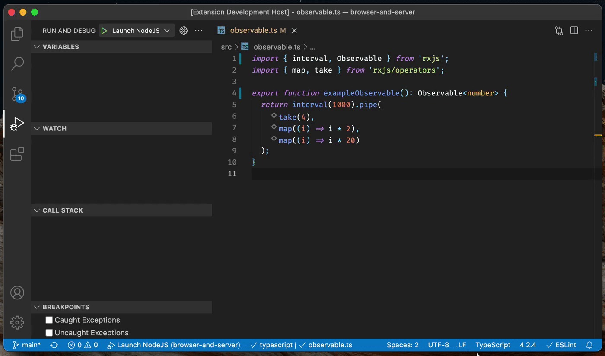
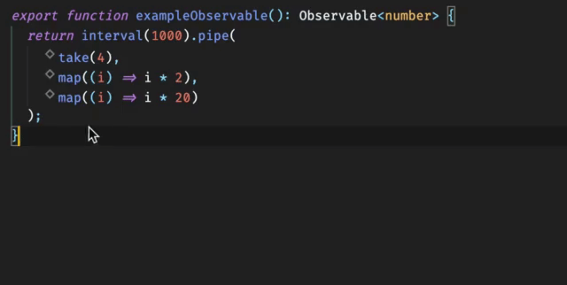
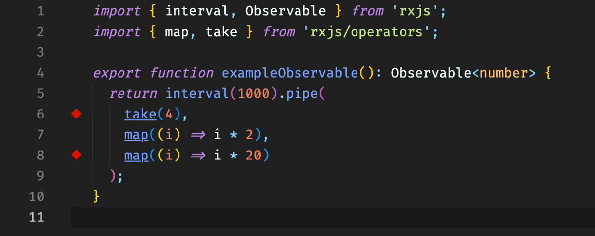
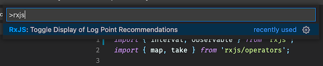

#  RxJS Debugger for Visual Studio Code

> Never, ever use `tap(console.log)` again.

Add non-intrusive debugging capabilities for [RxJS](https://rxjs.dev/) applications to [Visual Studio Code](https://code.visualstudio.com/).

## Features

- RxJS debugging, fully integrated with Visual Studio Code
- Works with RxJS 6
- Support for:
  - NodeJS-based RxJS applications
  - browser-based RxJS applications

### Operator Log Points

Operator log points make manually added `console.log` statements a thing of the past: RxJS Debugger detects [operators](https://rxjs.dev/guide/operators) automatically and recommends a log point, indicated with an empty diamond. Hover the mouse cursor on the operator to add or remove an operator log point:

Once you launch your application with the JavaScript debugger built-in to Visual Studio Code, enabled log points display [events of interest](https://rxjs.dev/guide/observable#anatomy-of-an-observable) inline in the editor:

- Subscribe
- Emitted values (next, error, complete)
- Unsubscribe

By default, RxJS Debugger clears logged events from the editor after you stop the JavaScript debugger. You can customize this behavior in the settings.

You can toggle the display of recommended log points via the command palette.

## Requirements

- [Visual Studio Code 1.60](https://code.visualstudio.com/) or newer
- [TypeScript 4.2](https://www.typescriptlang.org/) or newer
- [RxJS 6](https://rxjs.dev/)
- To debug NodeJS-based applications: [NodeJS 12](https://nodejs.org/) or newer
- To debug web applications:
  - [Webpack 5.60.0](https://webpack.js.org/) or newer
  - The [@rxjs-debugging/runtime-webpack](https://www.npmjs.com/package/@rxjs-debugging/runtime-webpack) Webpack plugin

## Roadmap & Future Development

Refer to the [milestones overview](https://github.com/swissmanu/rxjs-debugging-for-vscode/milestones) for planned, future iterations. The [issue list](https://github.com/swissmanu/rxjs-debugging-for-vscode/issues) provides an overview on all open development topics.

## Contributing

"RxJS Debugger for Visual Studio Code" welcomes any type of contribution! ❤️
Have a look at [CONTRIBUTING.md](./CONTRIBUTING.md) for further details.

## Playground

Jump right in and explore, how "RxJS Debugging for Visual Studio Code" can improve your RxJS debugging workflow:

https://github.com/swissmanu/playground-rxjs-debugging-for-vscode

## Research

This extension is based on research by Manuel Alabor. See [RESEARCH.md](./RESEARCH.md) for more information.
