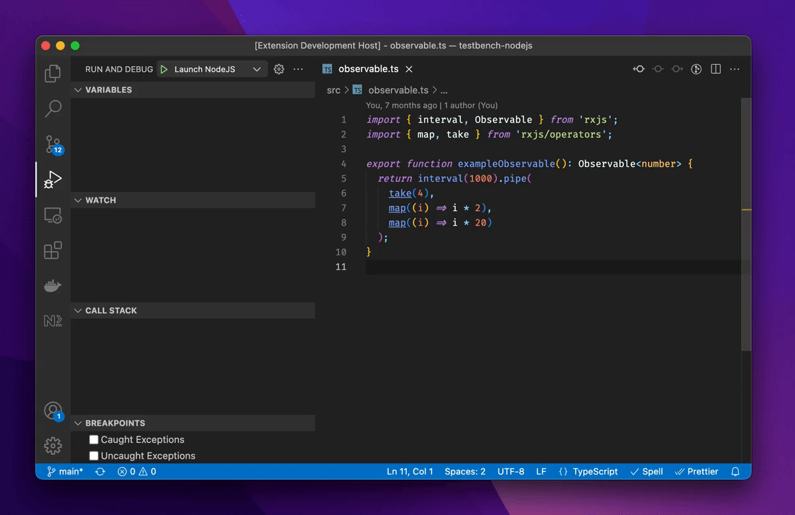

#  RxJS Debugging for Visual Studio Code

 

> Never, ever use `tap(console.log)` again.

Add non-intrusive debugging capabilities for [RxJS](https://rxjs.dev/) applications to [Visual Studio Code](https://code.visualstudio.com/).

## Features

- RxJS debugging, fully integrated with Visual Studio Code
- Works with RxJS 6.6.7 and newer
- Support for Node.js and Webpack-based RxJS applications

## Requirements

- [Visual Studio Code 1.61](https://code.visualstudio.com/) or newer
- [RxJS 6.6.7](https://rxjs.dev/) or newer
- To debug NodeJS-based applications:
  - [Node.js 12](https://nodejs.org/) or newer
- To debug Webpack-based web applications:
  - [Webpack 5.60.0](https://webpack.js.org/) or newer
  - The [@rxjs-debugging/runtime-webpack](https://www.npmjs.com/package/@rxjs-debugging/runtime-webpack) Webpack plugin

## Usage

### Operator Log Points

Operator log points make manually added `console.log` statements a thing of the past: RxJS Debugger detects [operators](https://rxjs.dev/guide/operators) automatically and recommends a log point. Hover the mouse cursor on the operator to add or remove a log point to the respective operator:

Once you launch your application with the JavaScript debugger built-in to Visual Studio Code, enabled log points display [events of interest](https://rxjs.dev/guide/observable#anatomy-of-an-observable) inline in the editor:

- Subscribe
- Emitted values (next, error, complete)
- Unsubscribe

By default, RxJS Debugger clears logged events from the editor after you stop the JavaScript debugger. You can customize this behavior in the settings.

Finally, you can toggle gutter indicators for recommended log points via the command palette:

----

## Roadmap & Future Development

Refer to the [milestones overview](https://github.com/swissmanu/rxjs-debugging-for-vscode/milestones) for planned, future iterations. The [issue list](https://github.com/swissmanu/rxjs-debugging-for-vscode/issues) provides an overview on all open development topics.

## Contributing

"RxJS Debugging for Visual Studio Code" welcomes any type of contribution! ❤️
Have a look at [CONTRIBUTING.md](./CONTRIBUTING.md) for further details.

## Playground

Jump right in and explore, how "RxJS Debugging for Visual Studio Code" can improve your RxJS debugging workflow:

https://github.com/swissmanu/playground-rxjs-debugging-for-vscode

## Analytics Data

The "RxJS Debugging for Visual Studio Code" extension collects usage analytics data from users who opt-in. See [ANALYTICS.md](./ANALYTICS.md) for more information on what data is collected and why.

## Research

This extension is based on research by Manuel Alabor. See [RESEARCH.md](./RESEARCH.md) for more information.
